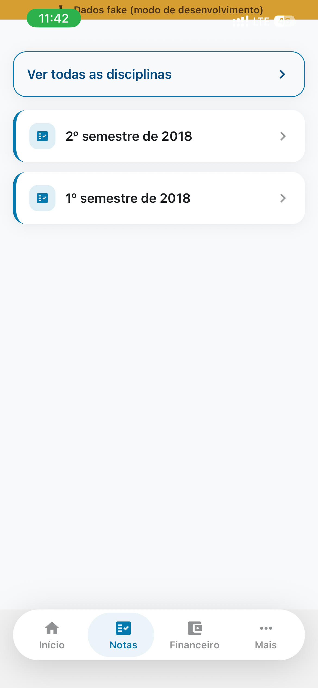
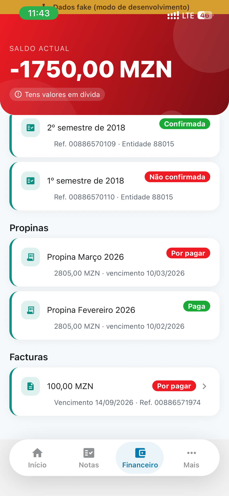
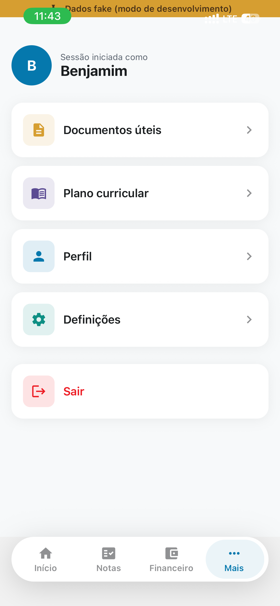
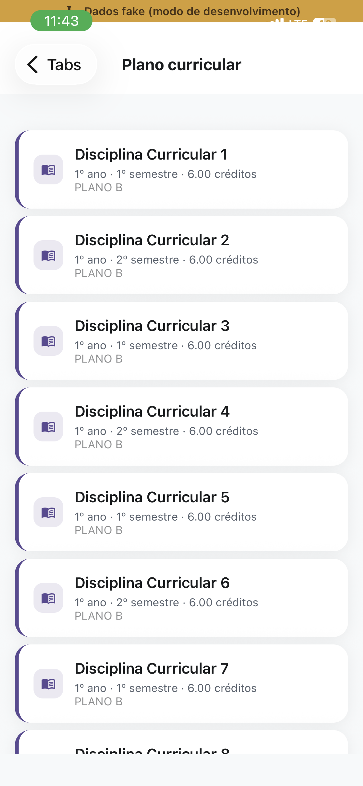
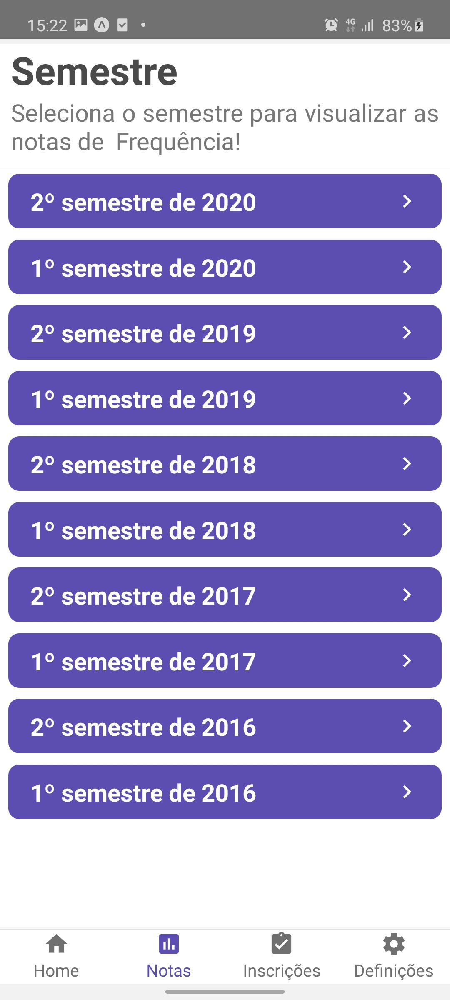
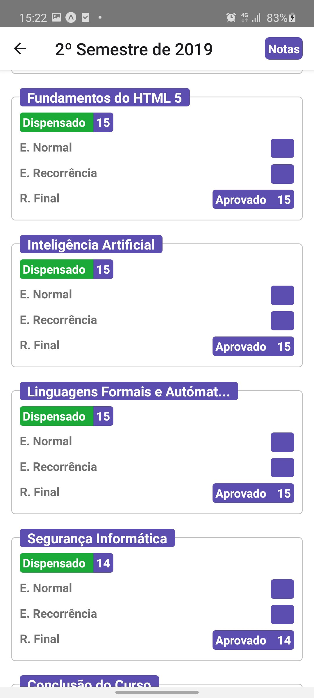
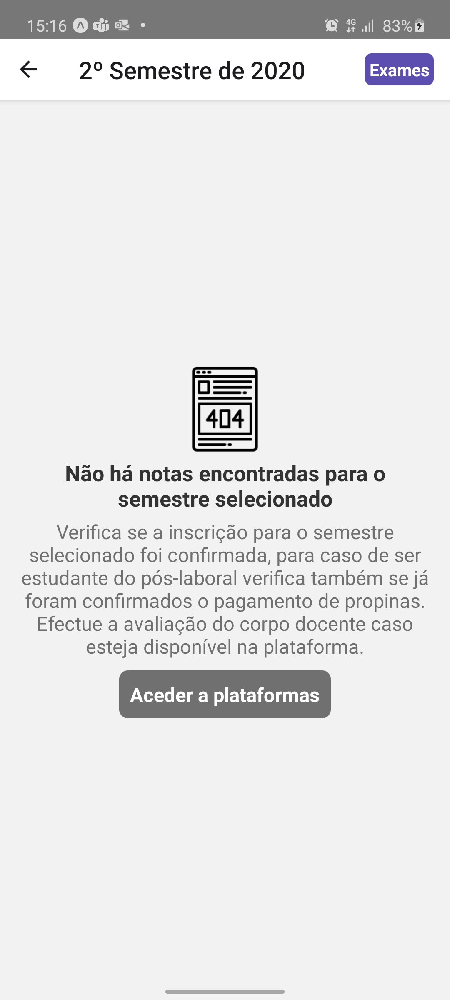

# SIGEUP Mobile

Aplicação móvel (Expo / React Native) para estudantes da **Universidade Pedagógica de Maputo** consultarem o seu percurso académico e financeiro no SIGEUP: notas, inscrições, propinas, facturas, documentos úteis e plano curricular — com download de PDF das notas, funcionamento offline-first e suporte de acessibilidade (narração por voz).

---

## Índice

- [Capturas de ecrã](#capturas-de-ecrã)
- [Funcionalidades](#funcionalidades)
- [Arquitectura e stack técnico](#arquitectura-e-stack-técnico)
- [Estrutura do projecto](#estrutura-do-projecto)
- [Pré-requisitos](#pré-requisitos)
- [Instalação](#instalação)
- [Configuração (.env)](#configuração-env)
- [Execução](#execução)
- [Modo de dados fake (desenvolvimento offline)](#modo-de-dados-fake-desenvolvimento-offline)
- [Cobertura da API do SIGEUP](#cobertura-da-api-do-sigeup)
- [Acessibilidade](#acessibilidade)
- [Resolução de problemas](#resolução-de-problemas)

---

## Capturas de ecrã

### Versão actual

| Início | Notas | Financeiro |
|---|---|---|
|  |  |  |

| Mais | Plano Curricular | Perfil | Documentos |
|---|---|---|---|
|  |  |  |  |

### Versão antiga (antes da reconstrução)

| Perfil | Notas — anos lectivos | Notas — frequência |
|---|---|---|
|  |  |  |

| Notas — exames | Estado vazio |
|---|---|
|  |  |

Mais ecrãs podem ser acrescentados da mesma forma: guarda o ficheiro em `docs/screenshots/new-version/` ou `docs/screenshots/old-version/` e referencia-o com ``.

---

## Funcionalidades

- **Login** com o número de estudante, alinhado ao contrato oficial da API (`multipart/form-data`).
- **Início** — saldo actual (com contador animado), alerta de dívida, atalhos rápidos e ligações úteis devolvidas pela API.
- **Notas** — lista de inscrições/semestres, notas por disciplina (testes, trabalhos, exames, resultado final) e vista "todas as disciplinas"; **download de PDF** da pauta de notas.
- **Financeiro** — saldo, estado das inscrições, propinas e facturas (com detalhe por factura).
- **Documentos úteis**, **Plano curricular** e **Perfil** do estudante.
- **Definições** — activar/desactivar o narrador de tela (acessibilidade).
- **Offline-first** — os dados ficam em cache local e aparecem instantaneamente mesmo sem ligação; sincronizam em segundo plano quando há rede (banner discreto avisa quando está offline).
- **Acessibilidade** — narração por voz em quase todos os elementos interactivos (útil para utilizadores com baixa visão), alvos de toque adequados, papéis e rótulos de acessibilidade (`accessibilityRole`/`accessibilityLabel`/`accessibilityHint`) em todo o app.

---

## Arquitectura e stack técnico

- **Expo SDK 54** / **React Native 0.81** / **React 19**
- **Navegação**: `@react-navigation` v7 (`native-stack` + `bottom-tabs`), com uma barra de navegação inferior totalmente customizada (`src/design-system/TabBar.js`)
- **Dados/rede**: `axios` + `@tanstack/react-query` (cache, refetch, `useInfiniteQuery` para paginação) com persistência em `AsyncStorage` (`@tanstack/react-query-persist-client`) para o comportamento offline-first, e `@react-native-community/netinfo` para detectar conectividade
- **PDF**: `expo-print` + `expo-sharing`
- **Sistema de design próprio** (`src/design-system/`): tokens de cor/tipografia/espaçamento, gradientes, `Card`, `Button`, `AppText`, `IconBadge`, `StatusPill`, `EmptyState`, `Skeleton`, `GradientHeader`, `PressableScale` (toque com animação de escala + háptica via `expo-haptics`), `TabBar`
- **Acessibilidade**: `expo-speech` para narração por voz, `AccessibilityInfo` para detectar leitores de ecrã

---

## Estrutura do projecto

```
src/
  contexts/auth.js        # sessão, login/logout, estado global de acessibilidade
  design-system/          # tokens + componentes visuais reutilizáveis
  helpers/                # narração por voz, formatação de moeda/data/nomes
  pages/                  # um ecrã por pasta (Home, Notas, Financeiro, ...)
  routes/                 # navegação (stack de login vs. stack principal + tabs)
  services/
    api.js                 # instância axios (headers, token, tratamento de 401)
    auth/ enrollments/ grades/ payments/ invoices/
    curricularPlans/ documents/ periods/   # um módulo por recurso da API
    mocks/                 # dados fake para desenvolvimento (ver secção abaixo)
    pdf.js                 # geração do PDF de notas
    queryClient.js         # configuração do React Query + persistência offline
```

---

## Pré-requisitos

- Node.js 20 LTS (recomendado; o projecto foi validado também em versões mais recentes)
- npm
- App **Expo Go** no telemóvel (Android ou iOS) — a versão do Expo Go tem de corresponder ao **SDK 54**
- Opcional: Android Studio / Xcode se preferires emulador em vez de dispositivo físico

---

## Instalação

```bash
git clone <url-do-repositório>
cd Sigeupmobile
npm install
```

---

## Configuração (.env)

Copia o ficheiro de exemplo e ajusta se necessário:

```bash
cp .env.example .env
```

| Variável | Descrição |
|---|---|
| `EXPO_PUBLIC_USE_FAKE_DATA` | `true` para usar dados fake locais em vez da API real (ver secção seguinte). `false` liga à API real (`https://api.sigeup.up.ac.mz/v1`). |

---

## Execução

```bash
npm start          # abre o Metro Bundler / QR code (Expo Go)
npm run android    # abre directamente num emulador/dispositivo Android
npm run ios        # abre directamente num simulador iOS (macOS)
npm run web        # abre no browser
```

Para testar num telemóvel físico: instala a app **Expo Go**, corre `npm start` e digitaliza o QR code apresentado no terminal. A versão do Expo Go instalada tem de corresponder ao SDK 54 deste projecto — se aparecer um erro de "legacy manifest" ou de versão incompatível, actualiza o Expo Go pela loja de aplicações.

---

## Modo de dados fake (desenvolvimento offline)

Com `EXPO_PUBLIC_USE_FAKE_DATA=true` no `.env`, todos os pedidos à API são interceptados (`axios-mock-adapter`) e respondidos com dados fictícios definidos em `src/services/mocks/fixtures.js` — não é necessário ter ligação à internet nem credenciais reais.

- **Utilizador:** `01.2650.2016`
- **Senha:** `01.2650.2016`

Qualquer outra combinação simula credenciais erradas (erro 404, tal como a API real). Enquanto o modo estiver activo, aparece um aviso "Dados fake (modo de desenvolvimento)" no topo do ecrã, para nunca ser confundido com dados reais.

Os dados fake incluem casos propositadamente variados para testar a interface: uma inscrição confirmada com notas completas, outra inscrição não confirmada que devolve erro 403 "dívida" (testa o ecrã de bloqueio), saldo negativo (testa o aviso de dívida) e disciplinas curriculares paginadas (testa o scroll infinito).

---

## Cobertura da API do SIGEUP

Base URL: `https://api.sigeup.up.ac.mz/v1` (documentação completa em [`SIGEUP_API_DOC.html`](SIGEUP_API_DOC.html)).

| # | Endpoint | Serviço | Ecrã |
|---|---|---|---|
| 1 | `POST /auth/login` | `services/auth` | Login |
| 2 | `POST /auth/logout` | `services/auth` | Início / Mais (Sair) |
| 3 | `GET /informationdocuments` | `services/documents` | Documentos |
| 4 | `GET /periods` | `services/periods` | — (disponível no serviço, sem ecrã dedicado) |
| 5 | `GET /enrollments` | `services/enrollments` | Notas / Financeiro |
| 6 | `GET /periods/{id}/enrollments` | `services/enrollments` | — (disponível no serviço, sem ecrã dedicado) |
| 7 | `GET /enrollments/{id}/grades` | `services/grades` | Notas → detalhe |
| 8 | `GET /enrollments/{id}/payments` | `services/payments` | — (disponível no serviço, sem ecrã dedicado) |
| 9 | `GET /periods/{id}/grades` | `services/grades` | — (disponível no serviço, sem ecrã dedicado) |
| 10 | `GET /periods/{id}/payments` | `services/payments` | — (disponível no serviço, sem ecrã dedicado) |
| 11 | `GET /grades` | `services/grades` | Notas → "Ver todas as disciplinas" |
| 12 | `GET /curricularplans` | `services/curricularPlans` | Plano Curricular |
| 13 | `GET /invoices` | `services/invoices` | Financeiro |
| 14 | `GET /invoices/{id}/details` | `services/invoices` | Detalhe da factura |
| 15 | `GET /payments/balance` | `services/payments` | Início / Financeiro |
| 16 | `GET /payments` | `services/payments` | Financeiro |

Os endpoints marcados como "sem ecrã dedicado" são variações por ano lectivo dos dados já acessíveis por inscrição (#5, #7, #16) e ficaram implementados a nível de serviço para uso futuro, mas sem uma tela própria por serem redundantes com o que já está coberto.

---

## Acessibilidade

- Narrador de tela próprio (`expo-speech`), activável em **Mais → Definições**, que lê em voz alta a maioria dos elementos ao toque — incluindo cada nota individual (teste, trabalho, exame) e não apenas o cartão inteiro.
- Detecção automática de leitor de ecrã do sistema (`AccessibilityInfo.isScreenReaderEnabled`) para ajustar o comportamento da narração própria.
- `accessibilityRole`, `accessibilityLabel` e `accessibilityHint` definidos de forma consistente em botões, cartões e estados vazios.
- Alvos de toque com pelo menos 44×48px.
- Paleta de cores verificada para contraste adequado (texto claro/escuro escolhido consoante o fundo).

---

## Resolução de problemas

**"Failed to parse manifest JSON" / versão do Expo Go incompatível**
A versão do Expo Go instalada no telemóvel tem de corresponder ao SDK do projecto (SDK 54). Actualiza a app Expo Go pela loja, ou usa `npx expo install --fix` no projecto para realinhar dependências caso venhas a atualizar o SDK novamente.

**`npm install` falha com `ENOSPC` / "no space left on device"**
O disco da máquina está cheio. Liberta espaço (`~/.cache`, `~/.npm`, Lixeira, imagens Docker não usadas) e tenta novamente.

**Erro `Cannot find module 'babel-preset-expo'`**
Sintoma de uma instalação anterior interrompida a meio (normalmente por falta de espaço em disco). Apaga `node_modules` e `package-lock.json` e corre `npm install` de novo.
